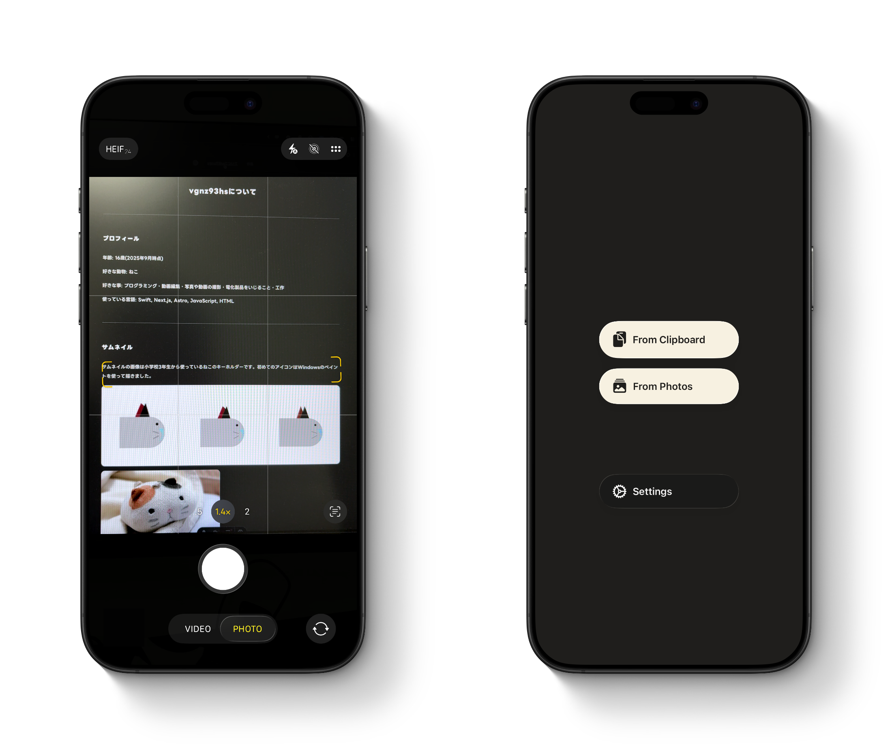
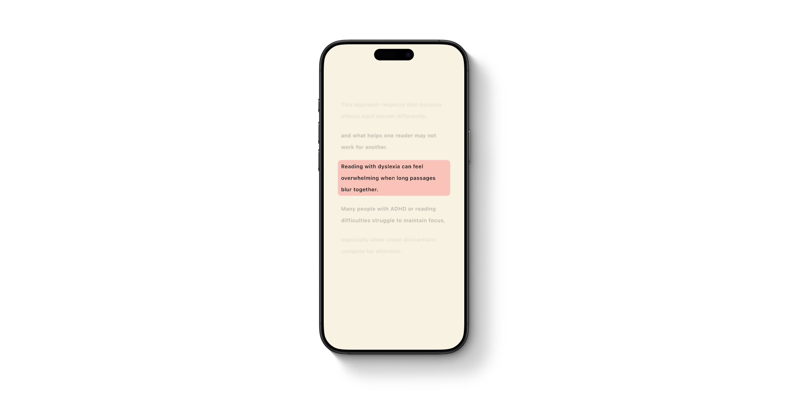
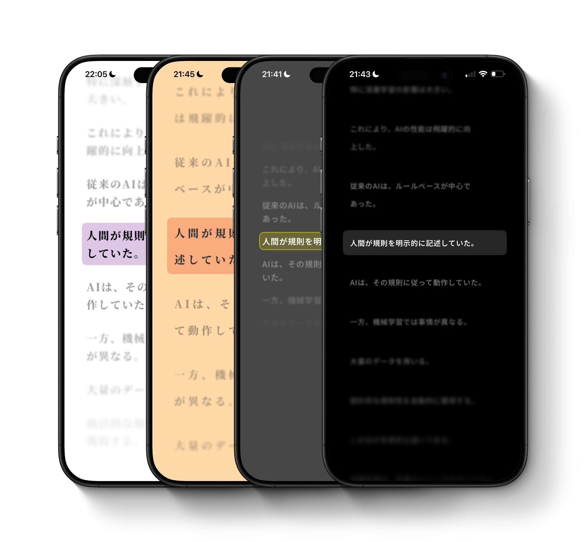
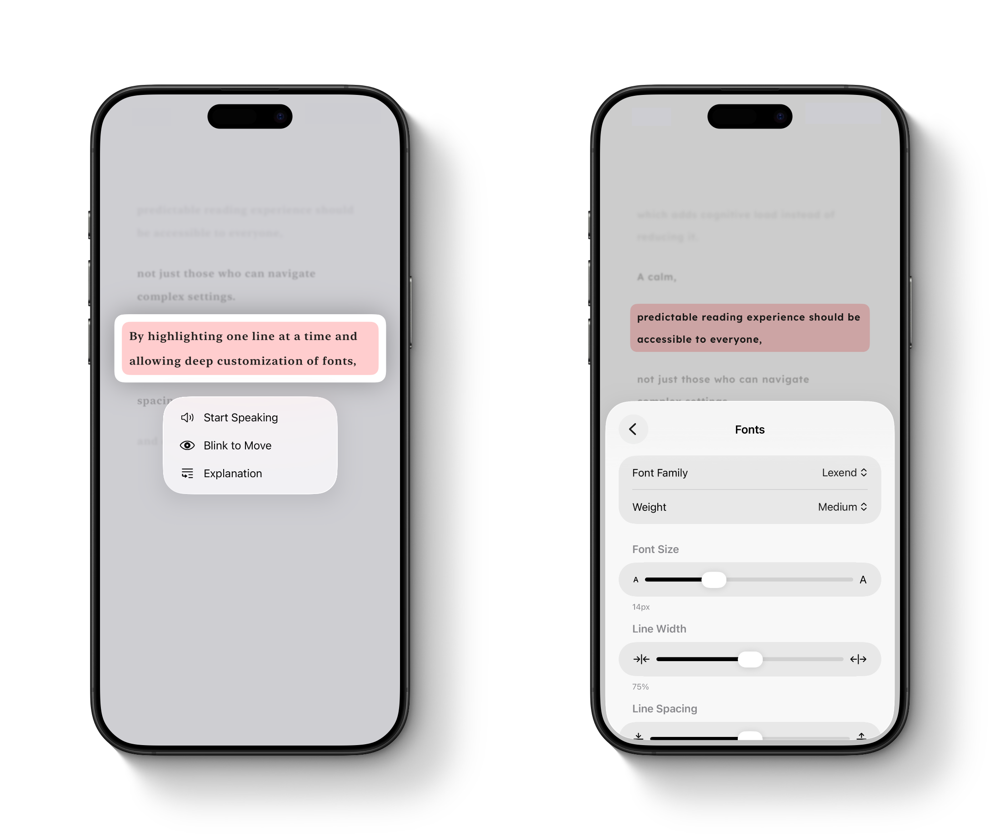

# RC Line for iOS

## Overview

RC Line is an iOS reading assistant designed for individuals with reading difficulties, such as dyslexia or visual tracking challenges.

By combining on-device OCR with intelligent line-by-line highlighting and a fully customizable interface, RC Line transforms scanned physical documents and digital text into an accessible, distraction-free reading experience. It eliminates visual overload and helps users maintain focus without losing their place.

- **On-Device OCR:** Instantly extracts text from images or the live camera.
- **Guided Reading:** Highlights one text segment at a time to enhance visual tracking.
- **Tailored Experience:** Offers full customization of fonts, line/letter spacing, and contrast modes.
- **Assistive Interactions:** Supports eyes-free and hands-free controls tailored for accessibility.

## Key Features

### Privacy-First Text Input (OCR)

- Leverages Apple's Vision Framework for fast, real-time text recognition.
- Processes everything entirely on-device, ensuring user privacy.

### Line-by-Line Highlighting & Gestures

- Segments text into readable chunks to reduce visual fatigue.
- Uses intuitive screen-splitting tap gestures to move between lines seamlessly, avoiding the need to hunt for small buttons.

### Advanced Accessibility Customization

- Supports a variety of typography options, including dyslexia-friendly fonts.
- Real-time preview adjustments for font size, line spacing, and high-contrast background themes to suit individual visual preferences.

### Advanced Features

- **Blink Detection:** Uses the front-facing TrueDepth camera to let users control line navigation using only eye blinks.
- **Haptic Guidance:** Provides distinct haptic patterns for navigation feedback, reducing reliance on visual cues alone.
- **AI-Powered Simplification:** Integrates on-device intelligence to explain complex phrasing instantly.

## Tech Stack

- **UI/UX:** SwiftUI, UIKit, CoreText
- **Vision & AI:** Vision Framework (OCR), ARKit / AVFoundation (Eye-tracking), CoreML
- **System Integration:** CoreHaptics, AVFAudio (Text-to-Speech)
